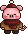

---

A story-driven top-down adventure about a little pig on a mission to rescue his family from the big bad wolves.

---

## built with

GameMaker Studio 2

---

## story

Piggy wakes up on his birthday to find nobody showed up — and soon discovers his brothers and mother have been taken by wolves. What follows is a dangerous journey across snow towns, wild west outposts, and dark wolf caves.

---

## world

- ❄️ Snow Town
- Wild West
- The Wolf Cave

---

## status

currently in development :)

---

